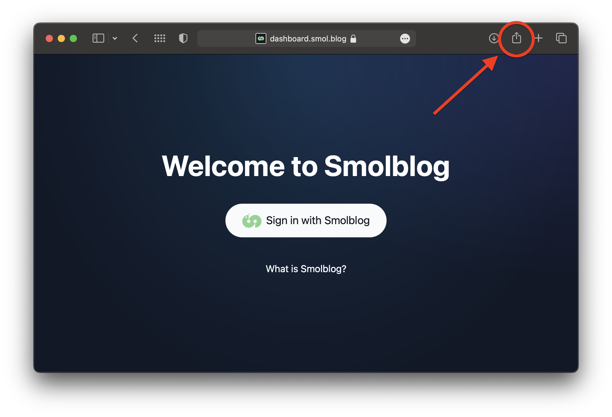
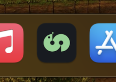

### Step 1: Click the share button

### Step 2: Click "Add to Dock"

You will be able to remove it from the Dock later.

### That's it!

## What else?

### Remove from the dock

You can remove the app form the Dock without uninstalling the app entirely.

You can right-click the app and select "Remove from Dock":

You can also drag the app out of the Dock:

The app will remain in Launchpad:

### Uninstall

To uninstall the web app, open Launchpad, then hold down the <kbd>option</kbd> key on your keyboard and click the "X":

## More Info

- [Official Apple help page](https://support.apple.com/en-us/HT213583)